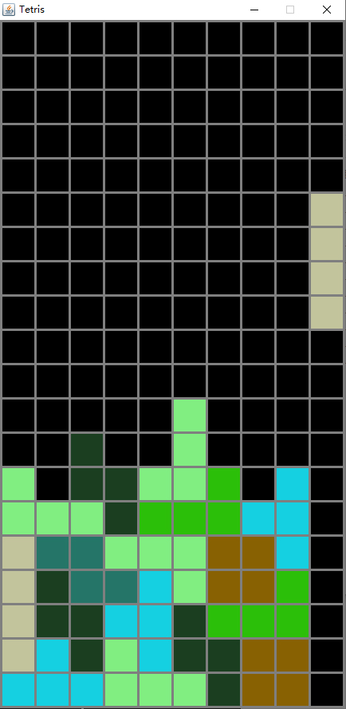

# 俄罗斯方块
基于java实现的俄罗斯方块
## 运行
```
javac Tetris.java
java Tetris
```
## 演示图

## 操作
AD键左右移动<br>
S键加速下降<br>
空格直接下降<br>
R键重新开始<br>
<br>
单手操作：<br>
W键顺时针旋转<br>
<br>
双手操作：<br>
J键逆时针旋转<br>
K键顺时针旋转
## 设置
修改Settings.java
```java
public static final int Size = 40;
public static final int BORDER = 3;
public static final int SPEED = 500;

public static final Color BACKGROUND_COLOR = new Color(0, 0, 0);
public static final Color BORDER_COLOR = new Color(127, 127, 127);
```