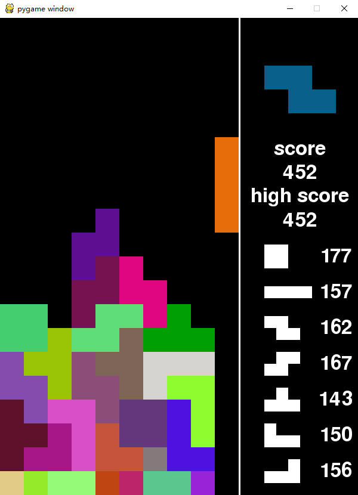

# 俄罗斯方块
基于python实现的俄罗斯方块
## 运行
```
pip install pygame
python3 main.py
```

## 操作
AD键左右移动<br>
S键加速下降<br>
空格直接下降<br>
R键重新开始<br>
P键暂停游戏<br>
<br>
单手操纵：<br>
W键顺时针旋转<br>
<br>
双手操作：<br>
J键逆时针旋转<br>
K键顺时针旋转<br>
<br>
得分规则：<br>
1次消除1行得1分<br>
1次消除2行得2分<br>
1次消除3行得3分<br>
1次消除4行得5分
## 实现
形状数据存放在一个三维数组中
```python
self.data = [
    [[1, 1], [1, 1]],
    [[0, 0, 0, 0], [0, 0, 0, 0], [1, 1, 1, 1], [0, 0, 0, 0]],
    [[1, 1, 0], [0, 1, 1], [0, 0, 0]],
    [[0, 1, 1], [1, 1, 0], [0, 0, 0]],
    [[0, 1, 0], [1, 1, 1], [0, 0, 0]],
    [[1, 0, 0], [1, 1, 1], [0, 0, 0]],
    [[0, 0, 1], [1, 1, 1], [0, 0, 0]]
]
```
### 核心函数
#### 旋转
```python
def rotate(self):
    size = len(self.data[self.z]) - 1
    for i in range((size + 1) // 2):
        for j in range(i, size - i):
            self.exchange([i, j], [size - j, i], [size - i, size - j], [j, size - i])

def exchange(self, *args):
    for i in range(len(args) - 1):
        (self.data[self.z][args[i][0]][args[i][1]],
         self.data[self.z][args[i + 1][0]][args[i + 1][1]]) = \
            (self.data[self.z][args[i + 1][0]][args[i + 1][1]],
             self.data[self.z][args[i][0]][args[i][1]])
```
因为第一层数组，也就是存放每个形状的二维数组的长度都不一样，所以用一个变量得到第一层的数组长度<br>
循环第一层是第一层数组需要交换的次数，如：<br>
3\*3的二维数组只需交换最外圈的数据，中心不动，也就是1次<br>
4\*4的二维数组交换外圈和内圈，也就是交换2次<br>
5\*5的二维数组有中心，也是交换2次<br>
循环第二层是每个圈的边，如：<br>
3\*3的二维数组长度是3，总次数是1次，每次交换2次<br>
(0, 0) > (2, 0) > (2, 2) > (0, 2)<br>
(0, 1) > (1, 0) > (2, 1) > (1, 2)<br>
4\*4的二维数组长度是4，总次数是2次，第1次交换3次，第2次交换1次<br>
第一次<br>
(0, 0) > (3, 0) > (3, 3) > (0, 3)<br>
(0, 1) > (2, 0) > (3, 2) > (1, 3)<br>
(0, 2) > (1, 0) > (3, 1) > (2, 3)<br>
第二次<br>
(1, 1) > (2, 1) > (2, 2) > (1, 2)<br>
<br>
简便的做法是定义好所有旋转后的数组，每次旋转就是做索引值的一个操作<br>
但这样的做法难度较低，我比较喜欢炫技，所以选了难度更高的方法
#### 碰撞检测
```python
def collide(self):
    for i in range(self.size[1]):
        for j in range(self.size[0]):
            if (not 0 <= self.x - self.place[0] + j <= 9 or self.y - self.place[1] + i > 19 or
                    self.data[self.z][i - self.place[1]][j - self.place[0]] and
                    self.y - self.place[1] + i >= 0 and
                    self.display.data[self.y - self.place[1] + i][self.x - self.place[0] + j]):
                return True
```
只要检测到超过边界或覆盖已有的数据，就返回一个True<br>
这样，不管是旋转还是移动，如果得到的是True就进行一个逆向操作进行还原就行了